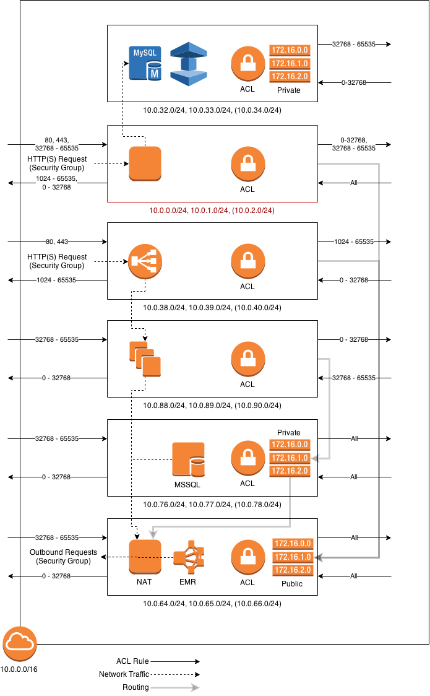

# Network Design

## Extensibility.
All network subnet default segments are /24 cidr blocks that start at multiple of 6. This is so that
a) additional subnets of similar characteristics can be provisioned next to the default with no segmentation.
b) it accomodates the extensible need of both 2 and 3 AZ subnets.

So for instance, for internet-access.subnets.template, it occupies in a 2 AZ region:
- 10.0.0.0, 10.0.1.0
- 10.0.2.0, 10.0.3.0 <- Additional deployment of internet-access.subnets.template
- 10.0.4.0, 10.0.5.0 <- Additional deployment of internet-access.subnets.template
Where as in a 3 AZ region:
- 10.0.0.0 ~ 10.0.2.0
- 10.0.3.0 ~ 10.0.5.0 <- Additional deployment of internet-access.subnets.template

## Security Consideration

The network ACL are designed with the following assumptions:
-	Any AWS managed services that do not provide root privilege user access are safe by default, i.e. ELB, RDS, ElastiCache, etc etc. Note this exclude services such as EMR as root access are provided even though it's a managed service.
- Any service or instance that provide root privilege user access and accept public traffic (0.0.0.0/0) of any kind are compromised and are potentially malicious.
- It is not possible to compromise systems that only allow outbound access and allow no public traffic of any kind.
- Each individual subnet has to be responsible for protecting themselves. E.g., use inbound blocking ACL rules rather than relying on other subnets' outbound blocking rules to stop traffic.
- Trojan Horse can connect via inbound Ephemeral data port. Therefore, Security Group stands as a mandatory complementary to the design of the security measure.

The cidr block are segmented into 4 quarters.
Subnets that serve public request.
AWS managed services that public servers rely on.
AWS ELB exposed publicly.
AWS ELB exposed internally that public servers may call into.
Internal subnets that are considered safe.

Essentially public subnet only calls into the 2nd to 4th type of subnets and will never access internal servers directly. This design completely mitigate the risk of using compromised servers to 'hop' into the network as sooner or later, they will be blocked by an AWS managed service, usually an ELB.

## Basic reference deployment.

  

10.0.0.0~2.0 -> Public Web Server  
(10.0.0.0/19 means enough room for another gateway subnet + nat enabled, there's an extra pair of subnet at end of every 32 subnets.)  
10.0.32.0~34.0 -> Private  
10.0.38.0~40.0 -> Public ELB  
10.0.50.0~52.0 -> Private ELB  
(10.0.32.0/19 are subnets shared by both public and private subnets??? It is also possible to blanket inbound blocking rule to include this range as these AWS managed services would not initiated connections to servers anyway.)  
10.0.64.0~66.0 -> Outbound access only subnet without nat  
10.0.76.0~78.0 -> Nat Enabled  
10.0.88.0~90.0 -> Public web behind elb.  

## Subnet characteristics.

## Dependencies.
nat-enabled.subnets.template
- internet-access.subnets.template (Required for deploying NAT.)
elb.subnets.template
- nat-enabled.subnets.template (Required for using the Routetable)
